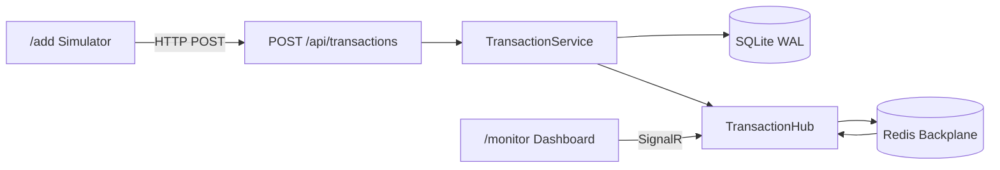

# Real-Time Financial Monitor MVP

**SEE APP**:
https://financial-monitor.onrender.com


A full-stack MVP for ingesting financial transactions, broadcasting updates in real time, and monitoring them from a responsive support dashboard.


## Architecture




See [ADR-001](docs/ADR-001-distributed-signalr.md) for distributed deployment details.

## Features

- **Backend (.NET 8)**: REST ingestion, SignalR hub, SQLite storage with WAL + write locking, Redis backplane
- **Frontend (React + TypeScript)**: `/add` simulator, `/monitor` live dashboard with batching + virtualization
- **Tests**: Backend xUnit + FluentAssertions; frontend Jest + React Testing Library
- **DevOps**: Multi-stage Dockerfile, docker-compose, Kubernetes manifests


## Quick Start (Docker)

```bash
docker-compose up --build
```

- Primary API: [http://localhost:8080](http://localhost:8080)
- Replica API: [http://localhost:8081](http://localhost:8081)
- Redis: localhost:6379

Open [http://localhost:8080/monitor](http://localhost:8080/monitor) for the dashboard and [http://localhost:8080/add](http://localhost:8080/add) for the simulator.

### Multi-Pod Demo

1. Open dashboard connected to replica: [http://localhost:8081/monitor](http://localhost:8081/monitor)
2. Submit transactions to primary: [http://localhost:8080/add](http://localhost:8080/add)
3. Observe updates appear on the replica dashboard via Redis backplane


## Local Development


### Backend

```bash
cd backend/src/FinancialMonitor.Api
dotnet run
```

API runs at [http://localhost:5289](http://localhost:5289) (Swagger at `/swagger`).

Redis is optional: leave `Redis:ConnectionString` empty for single-instance local work (no Redis required). Provide a connection string (for example `localhost:6379`) only when you want the SignalR Redis backplane.

### Frontend

```bash
cd frontend
npm install
npm run dev
```

Frontend runs at [http://localhost:5173](http://localhost:5173).

## API


### POST /api/transactions

```json
{
  "transactionId": "3fa85f64-5717-4562-b3fc-2c963f66afa6",
  "amount": 1500.50,
  "currency": "USD",
  "status": "Pending",
  "timestamp": "2024-01-15T10:00:00Z"
}
```


### GET /api/transactions?page=1&pageSize=50

Returns a paged list of transactions ordered by timestamp descending.

```json
{
  "items": [],
  "page": 1,
  "pageSize": 50,
  "totalCount": 120,
  "totalPages": 3,
  "hasNextPage": true,
  "hasPreviousPage": false
}
```

`page` starts at 1. `pageSize` defaults to 50 and must be between 1 and 200.

### SignalR Hub: /hubs/transactions

- Client calls `JoinDashboard` to receive an initial snapshot
- Server pushes `TransactionReceived` events for new transactions


## Testing

**Backend** — xUnit + FluentAssertions

```bash
cd backend
dotnet test
```

**Frontend** — Jest + React Testing Library

```bash
cd frontend
npm test
```


## Kubernetes

```bash
kubectl apply -f k8s/configmap.yaml
kubectl apply -f k8s/deployment.yaml
kubectl apply -f k8s/service.yaml
```

Build and load the image locally before deploying:

```bash
docker build -t financial-monitor:latest .
```

**LOGS**

backend log with Serilog 

path:

financial-monitor\backend\src\FinancialMonitor.Api\Logs 

## Distributed Architecture – Redis SignalR Backplane

1.Use a shared database such as PostgreSQL, SQL Server, or Azure SQL instead of per-pod SQLite.

2.Redis is optional in the local MVP. When Redis:ConnectionString is configured, Redis is used as a SignalR backplane to synchronize messages between multiple API replicas. set Redis ConnectionString in appsettings.json | Environment Variable

3.Deploy multiple API replicas behind a load balancer.

More in detail:

The problem:
When running multiple API replicas, a client connected to Pod A may not receive a transaction handled by Pod B because each pod has its own SignalR connections.

To solve this, Redis can be used as a SignalR Backplane:

All API replicas connect to the same Redis instance.
When Pod B receives a transaction and sends a TransactionReceived event, Redis propagates the SignalR message to the other replicas.
Pod A can then send the event to the client connected to it.
React /add
    |
    | POST /api/transactions
    v
  Pod B
    |
    +----> Database
    |
    +----> SignalR
             |
             v
        Redis Backplane
             |
             v
           Pod A
             |
             | SignalR
             v
       React /monitor
Current Configuration

The solution:

Redis is optional in the local MVP.

If Redis:ConnectionString is empty, the application uses regular in-process SignalR. When a Redis connection string is provided, SignalR uses AddStackExchangeRedis as the backplane.

Redis is used only for synchronizing SignalR messages between API replicas. It is not used as the main database.

Production

For a multi-replica production environment:

Use a shared database such as PostgreSQL, SQL Server, or Azure SQL instead of per-pod SQLite.
Use a shared/managed Redis instance for the SignalR backplane.
Deploy multiple API replicas behind a load balancer.
